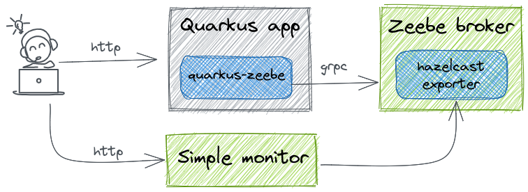
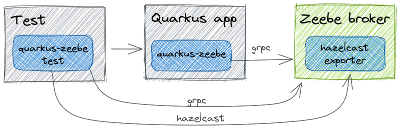

# Quarkus Zeebe

<!-- ALL-CONTRIBUTORS-BADGE:START - Do not remove or modify this section -->
[](https://github.com/quarkiverse/quarkus-zeebe/actions?query=workflow%3ABuild)
[](http://www.apache.org/licenses/LICENSE-2.0)
[](https://search.maven.org/search?q=g:io.quarkiverse.zeebe%20AND%20a:quarkus-zeebe-parent)
[](#contributors-)
<!-- ALL-CONTRIBUTORS-BADGE:END -->

## Usage

To use the extension, add the dependency to the target project:
```xml
<dependency>
    <groupId>io.quarkiverse.zeebe</groupId>
    <artifactId>quarkus-zeebe</artifactId>
    <version>0.3.0</version>
</dependency>
```

## Configuration

Build configuration
```properties
# enable auto load bpmn resources true|false
quarkus.zeebe.resources.enabled=true
# src/main/resources/bpmn 
quarkus.zeebe.resources.location=bpmn
# enable health check true|false
quarkus.zeebe.health.enabled=false
# enable opentracing true|false
quarkus.zeebe.opentracing.enabled=true
# enable opentelemetry true|false
quarkus.zeebe.opentelemetry.enabled=true
```

Runtime configuration
```properties
# broker configuration
quarkus.zeebe.client.broker.gateway-address=localhost:26500
quarkus.zeebe.client.broker.keep-alive=PT45S
# cloud configuration
quarkus.zeebe.client.cloud.cluster-id=
quarkus.zeebe.client.cloud.client-id=
quarkus.zeebe.client.cloud.client-secret=
quarkus.zeebe.client.cloud.region=bru-2
quarkus.zeebe.client.cloud.base-url=zeebe.camunda.io
quarkus.zeebe.client.cloud.auth-url=https://login.cloud.camunda.io/oauth/token
quarkus.zeebe.client.cloud.port=443
quarkus.zeebe.client.cloud.credentials-cache-path=
# worker configuration
quarkus.zeebe.client.worker.max-jobs-active=32
quarkus.zeebe.client.worker.threads=1
quarkus.zeebe.client.worker.default-name=default
quarkus.zeebe.client.worker.default-type=
# message configuration
quarkus.zeebe.client.message.time-to-live=PT1H
# security configuration
quarkus.zeebe.client.security.plaintext=true
quarkus.zeebe.client.security.cert-path=
# job configuration
quarkus.zeebe.client.job.timeout=PT5M
quarkus.zeebe.client.job.pool-interval=PT0.100S
# overwrite job handler annotation
quarkus.zeebe.client.workers.<type>.name=
quarkus.zeebe.client.workers.<type>.timeout=
quarkus.zeebe.client.workers.<type>.max-jobs-active=
quarkus.zeebe.client.workers.<type>.request-timeout=
quarkus.zeebe.client.workers.<type>.poll-interval=
quarkus.zeebe.client.workers.<type>.fetch-variables=
quarkus.zeebe.client.workers.<type>.exp-backoff-factor=1.6
quarkus.zeebe.client.workers.<type>.exp-jitter-factor=0.1
quarkus.zeebe.client.workers.<type>.exp-max-delay=5000
quarkus.zeebe.client.workers.<type>.exp-min-delay=50
# client tracing configuration
quarkus.zeebe.client.tracing.attributes=bpmn-process-id,bpmn-process-instance-key,bpmn-process-element-id,
bpmn-process-element-instance-key,bpmn-process-def-key,bpmn-process-def-ver,bpmn-retries,bpmn-component,
bpmn-job-type,bpmn-job-key,bpmn-class
```

## Tracing

Whether `zeebe` tracing is enabled or not is done by `quarkus.zeebe.tracing.enabled` build time property. The default is `true`, but shown here to indicate how it can be disabled.
```properties
quarkus.zeebe.tracing.enabled=true
```


### OpenTelemetry

If you already have your Quarkus project configured, you can add the `quarkus-opentelemetry-exporter-otlp` extension to your project.
```xml
<dependency>
    <groupId>io.quarkus</groupId>
    <artifactId>quarkus-opentelemetry-exporter-otlp</artifactId>
</dependency>
```

[Zeebe example](examples/opentelemetry)  
[Quarkus OpenTelemetry](https://quarkus.io/guides/opentelemetry)

### OpenTracing

If you already have your Quarkus project configured, you can add the `smallrye-opentracing` extension to your project.
```xml
<dependency>
    <groupId>io.quarkus</groupId>
    <artifactId>quarkus-smallrye-opentracing</artifactId>
</dependency>
```

[Zeebe example](examples/opentracing)  
[Quarkus OpenTracing](https://quarkus.io/guides/opentracing)

## Dev-Services
Dev Services for Zeebe is automatically enabled unless:
* `quarkus.zeebe.devservices.enabled` is set to false
* `quarkus.zeebe.broker.gateway-address` is configured

Dev Service for Zeebe relies on Docker to start the broker. If your environment does not support Docker, you will need 
to start the broker manually, or connect to an already running broker. You can configure the broker address using 
`quarkus.zeebe.broker.gateway-address`.



To activate [Simple-Monitor](https://github.com/camunda-community-hub/zeebe-simple-monitor) Dev Service use this configuration:
```properties
quarkus.zeebe.devservices.enabled=true
quarkus.zeebe.devservices.hazelcast.enabled=true
quarkus.zeebe.devservices.monitor.enabled=true
```
Property `quarkus.zeebe.devservices.hazelcast.enabled=true` will activate the [hazelcast exporter](https://github.com/camunda-community-hub/zeebe-hazelcast-exporter).

#### Configuration

```properties
quarkus.zeebe.devservices.enabled=true|false
quarkus.zeebe.devservices.port=
quarkus.zeebe.devservices.shared=true
quarkus.zeebe.devservices.serviceName=zeebe
quarkus.zeebe.devservices.imageName=
# zeebe broker with hazelcast
quarkus.zeebe.devservices.hazelcast.enabled=true|false
quarkus.zeebe.devservices.hazelcast.imageName=ghcr.io/camunda-community-hub/zeebe-with-hazelcast-exporter:1.3.3-1.1.1-SNAPSHOT
# zeebe simple monitor dev-service
quarkus.zeebe.devservices.monitor.enabled=true|false
quarkus.zeebe.devservices.monitor.port=
quarkus.zeebe.devservices.monitor.imageName=ghcr.io/camunda-community-hub/zeebe-simple-monitor:2.3.0
quarkus.zeebe.devservices.monitor.serviceName=zeebe-simple-monitor
```

## Simple usage

```java
@ZeebeWorker(type = "job1")
public class Job1 implements JobHandler {

    @Override
    public void handle(JobClient client, ActivatedJob job) throws Exception {
        Parameter p = job.getVariablesAsType(Parameter.class);
        client.newCompleteCommand(job.getKey())
                .variables(p).send().join();
    }
}
```

## Testing 

To use the test extension, add this dependency to the project:
```xml
<dependency>
    <groupId>io.quarkiverse.zeebe</groupId>
    <artifactId>quarkus-zeebe-test</artifactId>
    <version>0.3.0</version>
</dependency>
```

To use the `ZeebeClient` and `BpmnAssert` in the tests use the `@QuarkusTestResource(ZeebeTestResource.class)` and enable this configuration:
```properties
quarkus.zeebe.devservices.enabled=true
quarkus.zeebe.devservices.hazelcast.enabled=true
```
Test example
```java
import io.quarkiverse.zeebe.test.ZeebeTestResource;
import io.quarkus.test.common.QuarkusTestResource;
import io.camunda.zeebe.client.ZeebeClient;

@QuarkusTest
@QuarkusTestResource(ZeebeTestResource.class)
public class BaseTest extends AbstractTest {

    @InjectZeebeClient
    ZeebeClient client;

    @Test
    public void startProcessTest() {
        ProcessInstanceEvent event = client.newCreateInstanceCommand()
                .bpmnProcessId("test").latestVersion()
                .variables(Map.of("k","v")).send().join();

        ProcessInstanceAssert a = BpmnAssert.assertThat(event);
        await().atMost(7, SECONDS).untilAsserted(a::isCompleted);
    }
}
```
We can reuse the test for the integration test.
```java
import io.quarkus.test.junit.QuarkusIntegrationTest;

@QuarkusIntegrationTest
public class BaseIT extends BaseTest {

}
```
For more information check examples in the `integration-tests` directory in this repo.

## Contributors ✨

Thanks goes to these wonderful people ([emoji key](https://allcontributors.org/docs/en/emoji-key)):

<!-- ALL-CONTRIBUTORS-LIST:START - Do not remove or modify this section -->
<!-- prettier-ignore-start -->
<!-- markdownlint-disable -->
<table>
  <tr>
    <td align="center"><a href="https://www.lorislab.org"><br /><sub><b>Andrej Petras</b></sub></a><br /><a href="https://github.com/quarkiverse/quarkiverse-zeebe/commits?author=andrejpetras" title="Code">💻</a> <a href="#maintenance-andrejpetras" title="Maintenance">🚧</a></td>
  </tr>
</table>

<!-- markdownlint-restore -->
<!-- prettier-ignore-end -->

<!-- ALL-CONTRIBUTORS-LIST:END -->

This project follows the [all-contributors](https://github.com/all-contributors/all-contributors) specification.
Contributions of any kind welcome!
