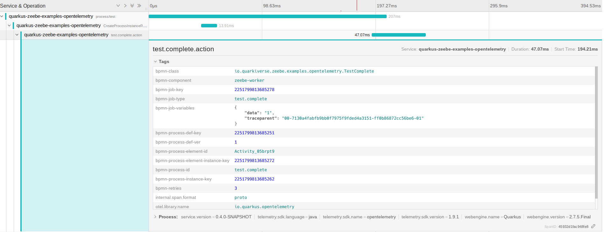

# Quarkus Zeebe


[](https://github.com/quarkiverse/quarkus-zeebe/actions?query=workflow%3ABuild)
[](http://www.apache.org/licenses/LICENSE-2.0)
[](https://central.sonatype.com/artifact/io.quarkiverse.zeebe/quarkus-zeebe-parent)
<!-- ALL-CONTRIBUTORS-BADGE:START - Do not remove or modify this section -->
[](#contributors-)
<!-- ALL-CONTRIBUTORS-BADGE:END -->

## Compatibility

Quarkus Zeebe provides two different version streams, one compatible with Quarkus 2.x and the other compatible with Quarkus 3.x.

| Quarkus | Quarkus Unleash | Documentation                                                                                  |
|---------|-----------------|------------------------------------------------------------------------------------------------|
| 2.x     | 0.x             | [Documentation](https://quarkiverse.github.io/quarkiverse-docs/quarkus-zeebe/0.x/index.html)   |
| 3.x     | 1.x             | [Documentation](https://quarkiverse.github.io/quarkiverse-docs/quarkus-zeebe/dev/index.html) |

Use the latest version of the corresponding stream, [the list of versions is available on Maven Central](https://central.sonatype.com/artifact/io.quarkiverse.zeebe/quarkus-zeebe-parent).


## Usage

To use the extension, add the dependency to the target project:
```xml
<dependency>
    <groupId>io.quarkiverse.zeebe</groupId>
    <artifactId>quarkus-zeebe</artifactId>
    <version>{version}</version>
</dependency>
```
### Upgrade

>In version `>=0.8.0` we replaced `@ZeebeWorker` with `@JobWorker` annotation.

>In version `>=0.7.0` we removed the hazelcast dependency and [zeebe-simple-monitor](https://github.com/camunda-community-hub/zeebe-simple-monitor)
for test and dev services. Now we do use [zeebe-test-container](https://github.com/camunda-community-hub/zeebe-test-container) with [debug exporter](https://github.com/camunda-community-hub/zeebe-test-container#debug-exporter) 
and [zeebe-dev-monitor](https://github.com/lorislab/zeebe-dev-monitor). In test module we remove our assert API and switch to Camunda [BpmnAssert](https://github.com/camunda/zeebe-process-test/blob/main/assertions/src/main/java/io/camunda/zeebe/process/test/assertions/BpmnAssert.java) 
from [zeebe-process-test](https://github.com/camunda/zeebe-process-test).

API migration

| 0.6.x                                | 0.7.x                                               |
|--------------------------------------|-----------------------------------------------------|
| io.quarkiverse.zeebe.test.BpmnAssert | io.camunda.zeebe.process.test.assertions.BpmnAssert |


## Configuration

Build configuration
```properties
# enable auto load bpmn resources true|false
quarkus.zeebe.resources.enabled=true
# src/main/resources/bpmn 
quarkus.zeebe.resources.location=bpmn
# enable health check true|false
quarkus.zeebe.health.enabled=false
# enable opentracing true|false
quarkus.zeebe.tracing.enabled=true
# enable metrics true|false
quarkus.zeebe.metrics.enabled=true
```

Runtime configuration
```properties
# broker configuration
quarkus.zeebe.client.broker.gateway-address=localhost:26500
quarkus.zeebe.client.broker.keep-alive=PT45S
# Specify a cluster id.
quarkus.zeebe.client.cloud.cluster-id=
# Specify a client id.
quarkus.zeebe.client.cloud.client-id=
# Specify a client secret to request an access token.
quarkus.zeebe.client.cloud.client-secret=
# Specify a cloud region.
quarkus.zeebe.client.cloud.region=bru-2
quarkus.zeebe.client.cloud.base-url=zeebe.camunda.io
quarkus.zeebe.client.cloud.auth-url=https://login.cloud.camunda.io/oauth/token
quarkus.zeebe.client.cloud.port=443
quarkus.zeebe.client.cloud.credentials-cache-path=
# message configuration
quarkus.zeebe.client.message.time-to-live=PT1H
# security configuration
quarkus.zeebe.client.security.plaintext=true
# Specify a path to a certificate with which to validate gateway requests.
quarkus.zeebe.client.security.cert-path=
# Overrides the authority used with TLS virtual hosting.
quarkus.zeebe.client.security.override-authority=

# job configuration
quarkus.zeebe.client.job.max-jobs-active=32
quarkus.zeebe.client.job.worker-execution-threads=1
quarkus.zeebe.client.job.worker-name=default
quarkus.zeebe.client.job.default-type=
quarkus.zeebe.client.job.timeout=PT5M
quarkus.zeebe.client.job.request-timeout=
quarkus.zeebe.client.job.pool-interval=PT0.100S
quarkus.zeebe.client.job.exp-backoff-factor=1.6
quarkus.zeebe.client.job.exp-jitter-factor=0.1
quarkus.zeebe.client.job.exp-max-delay=5000
quarkus.zeebe.client.job.exp-min-delay=50
# overwrite job handler annotation
quarkus.zeebe.client.workers.<type>.name=
quarkus.zeebe.client.workers.<type>.enabled=
quarkus.zeebe.client.workers.<type>.timeout=
quarkus.zeebe.client.workers.<type>.max-jobs-active=
quarkus.zeebe.client.workers.<type>.request-timeout=
quarkus.zeebe.client.workers.<type>.poll-interval=
# Auto-complete
quarkus.zeebe.client.auto-complete.max-retries=20
quarkus.zeebe.client.auto-complete.retry-delay=50L
quarkus.zeebe.client.auto-complete.exp-backoff-factor=1.5
quarkus.zeebe.client.auto-complete.exp-jitter-factor=0.2
quarkus.zeebe.client.auto-complete.exp-max-delay=1000
quarkus.zeebe.client.auto-complete.exp-min-delay=50

# client tracing configuration
quarkus.zeebe.client.tracing.attributes=
# bpmn-process-id,bpmn-process-instance-key,bpmn-process-element-id,
# bpmn-process-element-instance-key,bpmn-process-def-key,bpmn-process-def-ver,bpmn-retries,bpmn-component,
# bpmn-job-type,bpmn-job-key,bpmn-class,bpmn-class-method
```

### Exemplary Setup for your local development
Generally speaking there are three ways to configure your quarkus project to speak with camunda:
- Local dev instance with dev services
- Shared local dev instance
- Direct interaction with Camunda SaaS/ on-premise

You can see some exemplary configurations for each of the setups below. Please note that these are only exemplary and can be adapted to your needs.

#### Local dev instance with dev services

```properties
# enable auto load bpmn resources 
quarkus.zeebe.resources.enabled=true
# src/main/resources/bpmn
quarkus.zeebe.resources.location=bpmn
# Enable zeebe Dev Service:
quarkus.zeebe.devservices.enabled=true
# only start devservices, if no running docker container is found
quarkus.zeebe.devservices.shared=true
# zeebe service name
quarkus.zeebe.devservices.service-name=zeebe_broker
# enable reusable zeebe test-container (https://www.testcontainers.org/features/reuse/)
quarkus.zeebe.devservices.reuse=false
# enable zeebe monitor Dev Service:
quarkus.zeebe.devservices.monitor.enabled=true
# zeebe monitor service name
quarkus.zeebe.devservices.monitor.service-name=zeebe-dev-monitor
# enable reusable zeebe test-container (https://www.testcontainers.org/features/reuse/)
quarkus.zeebe.devservices.monitor.reuse=false
# enable hot restart for bpmn subdirectories changes
quarkus.zeebe.dev-mode.watch-bpmn-dir=true
# enable hot restart for bpmn files changes
quarkus.zeebe.dev-mode.watch-bpmn-files=true
# enable hot restart for job worker changes
quarkus.zeebe.dev-mode.watch-job-worker=true
```

#### Shared local dev instance

```properties
quarkus.zeebe.client.broker.gateway-address=localhost:26500
# If you are sure that there is already an instance running, yu can directly deactivate it
quarkus.zeebe.devservices.enabled=false
quarkus.zeebe.devservices.shared=true
quarkus.zeebe.devservices.monitor.serviceName=zeebe-dev-monitor
quarkus.zeebe.devservices.serviceName=zeebe_broker
```

#### Direct interaction with Camunda live instance
Preferably you would be using a dev instance of Camunda and not your production process engine ;)

```properties
# Disable local dev services
quarkus.zeebe.devservices.enabled=false

# Enter your cloud credentials from the zeebe portal
quarkus.zeebe.client.broker.gateway-address=
# Specify a cluster id.
quarkus.zeebe.client.cloud.cluster-id=
# Specify a client id.
quarkus.zeebe.client.cloud.client-id=
# Specify a client secret to request an access token.
quarkus.zeebe.client.cloud.client-secret=
# Specify a cloud region.
quarkus.zeebe.client.cloud.region=
quarkus.zeebe.client.cloud.base-url=zeebe.camunda.io
quarkus.zeebe.client.cloud.auth-url=https://login.cloud.camunda.io/oauth/token
quarkus.zeebe.client.cloud.port=443

# Make sure you are disabling plaintext security, otherwise connection will fail
quarkus.zeebe.client.security.plaintext=false
```

## Metrics
Whether `zeebe` metrics is enabled or not is done by `quarkus.zeebe.metrics.enabled` build time property. 
The default is `true`, but shown here to indicate how it can be disabled.
```properties
quarkus.zeebe.metrics.enabled=true
```
You can access the following metrics:  

* `camunda.job.invocations`: Number of invocations of job workers (tagging the job type)
* `activated`: The job was activated and started to process an item
* `completed`: The processing was completed successfully
* `failed`: The processing failed with some exception
* `bpmn-error`: The processing completed by throwing an ZeebeBpmnError (which means there was no technical problem)

Example:
```
# TYPE camunda_job_invocations counter
# HELP camunda_job_invocations  
camunda_job_invocations_total{action="activated",type="gateway-empty-data"} 1.0
camunda_job_invocations_total{action="completed",type="gateway-show-data"} 2.0
camunda_job_invocations_total{action="activated",type="gateway-show-data"} 2.0
camunda_job_invocations_total{action="completed",type="gateway-read-data"} 2.0
```
### Micrometer
If you already have your Quarkus project configured, you can add the `quarkus-micrometer-registry-prometheus` extension to your project.
```xml
<dependency>
    <groupId>io.quarkus</groupId>
    <artifactId>quarkus-micrometer-registry-prometheus</artifactId>
</dependency>
```
[Quarkus Micrometer](https://quarkus.io/guides/telemetry-micrometer-tutorial)

## Tracing

Whether `zeebe` tracing is enabled or not is done by `quarkus.zeebe.tracing.enabled` build time property. The default is `true`, but shown here to indicate how it can be disabled.
```properties
quarkus.zeebe.tracing.enabled=true
```


### OpenTelemetry

If you already have your Quarkus project configured, you can add the `quarkus-opentelemetry-exporter-otlp` extension to your project.
```xml
<dependency>
    <groupId>io.quarkus</groupId>
    <artifactId>quarkus-opentelemetry-exporter-otlp</artifactId>
</dependency>
```

[Zeebe example](examples/opentelemetry)  
[Quarkus OpenTelemetry](https://quarkus.io/guides/opentelemetry)

## Dev-Services
Dev Services for Zeebe is automatically enabled unless:
* `quarkus.zeebe.devservices.enabled` is set to false
* `quarkus.zeebe.broker.gateway-address` is configured

Dev Service for Zeebe relies on Docker to start the broker. If your environment does not support Docker, you will need 
to start the broker manually, or connect to an already running broker. You can configure the broker address using 
`quarkus.zeebe.broker.gateway-address`.


To activate [Zeebe-Dev-Monitor](https://github.com/lorislab/zeebe-dev-monitor) Dev Service use this configuration:
```properties
quarkus.zeebe.devservices.enabled=true
quarkus.zeebe.devservices.monitor.enabled=true
```
Property `qquarkus.zeebe.devservices.monitor.enabled=true` will activate the debug exporter.

#### Configuration

```properties
quarkus.zeebe.devservices.enabled=true|false
quarkus.zeebe.devservices.port=
quarkus.zeebe.devservices.shared=true
quarkus.zeebe.devservices.service-name=zeebe
quarkus.zeebe.devservices.image-name=
# zeebe dev monitor dev-service
quarkus.zeebe.devservices.monitor.enabled=true|false
quarkus.zeebe.devservices.monitor.port=
quarkus.zeebe.devservices.monitor.image-name=ghcr.io/lorislab/zeebe-dev-monitor:1.0.0
quarkus.zeebe.devservices.monitor.service-name=zeebe-dev-monitor
```

## Implement Job Worker

You need to configure the job type via the `JobWorker` annotation:
```java
@JobWorker(type = "my-job")
public void executeMyJob() {
    // handles jobs of type 'my-job'
}
```
If you don't specify the `type` the method name is use as default:
```java
@JobWorker
public void test() {
        // handles jobs of type 'test'
}
```
Or you can set a default job type:
```properties
quarkus.zeebe.client.job.default-type=test
```

### Variables

You can specify that you only want to fetch some variables or when executing a job, which can decrease load and improve
performance:
```java
@JobWorker(type="test", fetchVariables={"var1", "var2"})
public void test(final JobClient client, final ActivatedJob job) {
    String var1 = (String) job.getVariablesAsMap().get("var1");
    System.out.println(var1);
    // ...
}
```

### `@Variable`

By using the `@Variable` annotation there is a shortcut to make variable retrieval simpler, including the type cast:
```java
@JobWorker(type="test")
public void test(final JobClient client, final ActivatedJob job, @Variable String var1) {
    System.out.println(var1);
    // ...
}
```

With `@Variable` or `fetchVariables` you limit which variables are loaded from the workflow engine. 
You can also override this with `fetchAllVariables` and force that all variables are loaded anyway:
```java
@JobWorker(type="test", fetchAllVariables=true)
public void test(final JobClient client, final ActivatedJob job) {
    String var1 = (String) job.getVariablesAsMap().get("var1");
    System.out.println(var1);
    // ...
}
```

### `@VariablesAsType`

You can also use your own class into which the process variables are mapped to (comparable to getVariablesAsType() in 
the Java Client API). Therefore, use the `@VariablesAsType` annotation. In the below example, Parameter refers to your own class:
```java
@JobWorker(type = "job1")
public void job1(@VariablesAsType Parameter p) {
    System.out.println(p.getValue());
    p.setValue(1);
    // ... custom code
    return param;
}
```

### Fetch variables via `Job`

You can access variables of a process via the ActivatedJob object, which is passed into the method if it is a parameter:
```java
@JobWorker(type="test")
public void test(final ActivatedJob job) {
    String var1 = (String) job.getVariablesAsMap().get("var1");
    System.out.println(var1);
    // ...
}
```

### Simple usage

```java

public class Job1Worker {
    
    @JobWorker(type = "job1")
    public void job1(@VariablesAsType Parameter p) {
        // ... custom code
        return param;
    }
    
    @JobWorker(type = "job2")
    public Parameter job1(@VariablesAsType Parameter p) {
        // ... custom code
        return p;
    }
    
}
```

### `@CustomHeader`
You can use the `@CustomHeader` annotation for a parameter to retrieve custom header for a job:
```java
@JobWorker(type = "job1")
public void job1(@VariablesAsType Parameter p, @CustomHeader String header1, @CustomHeader("custom-header") String header2) {
    System.out.println(header1);
    System.out.println(header2);
    System.out.println(p.getValue());
    p.setValue(1);
    // ... custom code
    return param;
}
```

### `@CustomHeaders`
You can use the `@CustomHeaders` annotation for a parameter to retrieve custom headers for a job:
```java
@JobWorker(type = "job1")
public void job1(@VariablesAsType Parameter p, @CustomHeaders Map<String, String> headers) {
    System.out.println(headers.get("header1"));
    System.out.println(headers.get("custom-header"));
    System.out.println(p.getValue());
    p.setValue(1);
    // ... custom code
}
```

### Non-blocking Methods

By default, a scheduled method is executed on the main executor for blocking tasks. As a result, a technology that is 
designed to run on a `Vert.x` event loop (such as Hibernate Reactive) cannot be used inside the method body. For this 
reason, a job worker method that returns `java.util.concurrent.CompletionStage<?>` or `io.smallrye.mutiny.Uni<Void>` 
or is annotated with `@io.smallrye.common.annotation.NonBlocking` is executed on the Vert.x event loop.

```java
@JobWorker(type = "job1")
public Uni<Void> job1(final ActivatedJob job) {
    // ... custom code ...
    // no need to call client.newCompleteCommand()...
}
```
The return type `Uni<Void>` instructs the job worker to execute the method on the Vert.x event loop.

### Auto-completing jobs

By default, the autoComplete attribute is set to true for any job worker. In this case, the Quarkus extension will take 
care about job completion for you:
```java
@JobWorker(type = "job1")
public void job1(final ActivatedJob job) {
    // ... custom code ...
    // no need to call client.newCompleteCommand()...
}
```
Note that the code within the handler method needs to be synchronously executed, as the completion will be triggered 
right after the method has finished.

When using autoComplete you can:
* Return a Map, String, InputStream, or Object, which then will be added to the process variables  
* Throw a ZeebeBpmnError which results in a BPMN error being sent to Zeebe    
* Throw any other Exception that leads in a failure handed over to Zeebe  

```java
@JobWorker(type = "job1")
public Map<String, Object> job1(final ActivatedJob job) {
    // ... custom code ...
    if (ok) {
       return responseMap;   
    } else {
       throw new ZeebeBpmnError("Error code", "Error message");   
    }
}
```
### Programmatically completing jobs
Your job worker code can also complete the job itself. This gives you more control about when exactly you want to 
complete the job (e.g. allowing the completion to be moved to reactive callbacks):
```java
@JobWorker(type = "job1")
public void job1(final JobClient client, final ActivatedJob job) {
    // ... custom code ...
    client.newCompleteCommand(job.getKey()).send()
        .exceptionally( throwable -> { throw new RuntimeException("Could not complete job " + job, throwable); });
}
```
Ideally, you don't use blocking behavior like `send().join()`, as this is blocking call to wait for the issues command
to be executed on the workflow engine. While this is very straightforward to use and produces easy-to-read code, 
blocking code is limited in terms of scalability.

That's why the worker above showed a different pattern (using exceptionally), often you might also want to use the 
whenComplete callback:
```java
 client.newCompleteCommand(job.getKey()).send()
        .whenComplete((result, exception) -> {});
```
This registers a callback to be executed if the command on the workflow engine was executed or resulted in an exception. 
This allows for parallelism. This is discussed in more detail in 
[this blog post about writing good workers for Camunda Cloud](https://blog.bernd-ruecker.com/writing-good-workers-for-camunda-cloud-61d322cad862).

> Note that when completing jobs programmatically, you must specify `autoComplete = false`. Otherwise, there is a race 
> condition between your programmatic job completion and the Quarkus extension integration job completion, this can 
> lead to unpredictable results.

### Throwing `ZeebeBpmnError`
Whenever your code hits a problem that should lead to a [BPMN error](https://docs.camunda.io/docs/reference/bpmn-processes/error-events/error-events/) being raised, you can simply throw a ZeebeBpmnError 
providing the error code used in BPMN:
```java
@JobWorker(type = "job1")
public Map<String, Object> job1(final ActivatedJob job) {
    // ... custom code ...
    if (ok) {
       return responseMap;   
    } else {
       throw new ZeebeBpmnError("Error code", "Error message");   
    }
}
```

## Testing 

To use the test extension, add this dependency to the project:
```xml
<dependency>
    <groupId>io.quarkiverse.zeebe</groupId>
    <artifactId>quarkus-zeebe-test</artifactId>
    <version>{version}</version>
    <scope>test</scope>
</dependency>
```


To use the `ZeebeClient` and `BpmnAssert` in the tests use the `@QuarkusTestResource(ZeebeTestResource.class)` and enable this configuration:
```properties
quarkus.zeebe.devservices.enabled=true
```
Test example
```java
import io.quarkiverse.zeebe.test.ZeebeTestResource;
import io.quarkus.test.common.QuarkusTestResource;
import io.camunda.zeebe.client.ZeebeClient;

@QuarkusTest
@QuarkusTestResource(ZeebeTestResource.class)
public class BaseTest {

    @InjectZeebeClient
    ZeebeClient client;

    @Test
    public void startProcessTest() {
        ProcessInstanceEvent event = client.newCreateInstanceCommand()
                .bpmnProcessId("test").latestVersion()
                .variables(Map.of("k","v")).send().join();

        ProcessInstanceAssert a = BpmnAssert.assertThat(event);
        await().atMost(7, SECONDS).untilAsserted(a::isCompleted);
    }
}
```
We can reuse the test for the integration test.
```java
import io.quarkus.test.junit.QuarkusIntegrationTest;

@QuarkusIntegrationTest
public class BaseIT extends BaseTest {

}
```
For more information check examples in the `integration-tests` directory in this repo.

### Testing with embedded engine

> The Zeebe process test embedded engine requires Java version >= 17

```java
import io.quarkiverse.zeebe.test.ZeebeTestEmbeddedResource;
import io.quarkus.test.common.QuarkusTestResource;
import io.camunda.zeebe.client.ZeebeClient;

@QuarkusTest
@QuarkusTestResource(ZeebeTestEmbeddedResource.class)
public class BaseTest {

    @InjectZeebeClient
    ZeebeClient client;

    @Test
    public void startProcessTest() {
        ProcessInstanceEvent event = client.newCreateInstanceCommand()
                .bpmnProcessId("test").latestVersion()
                .variables(Map.of("k","v")).send().join();

        ProcessInstanceAssert a = BpmnAssert.assertThat(event);
        await().atMost(7, SECONDS).untilAsserted(a::isCompleted);
    }
}
```

## Contributors ✨

Thanks goes to these wonderful people ([emoji key](https://allcontributors.org/docs/en/emoji-key)):

<!-- ALL-CONTRIBUTORS-LIST:START - Do not remove or modify this section -->
<!-- prettier-ignore-start -->
<!-- markdownlint-disable -->
<table>
  <tr>
    <td align="center"><a href="https://www.lorislab.org"><br /><sub><b>Andrej Petras</b></sub></a><br /><a href="https://github.com/quarkiverse/quarkiverse-zeebe/commits?author=andrejpetras" title="Code">💻</a> <a href="#maintenance-andrejpetras" title="Maintenance">🚧</a></td>
  </tr>
</table>

<!-- markdownlint-restore -->
<!-- prettier-ignore-end -->

<!-- ALL-CONTRIBUTORS-LIST:END -->

This project follows the [all-contributors](https://github.com/all-contributors/all-contributors) specification.
Contributions of any kind welcome!
